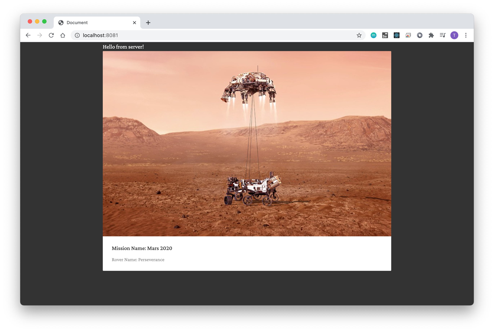

# Build React Server Side Rendering [SSR]

using Webpack and Babel

## 1. Install dependencies
    
    yarn

## 2. Build Client Side 
termial 1

    yarn build

## 3. Build Server Side 
termial 2

    yarn server:build

## 4. Start Server Sdie 
termial 3

    yarn server:start

### Demo

Server Render

After 3 sec, Client Render

